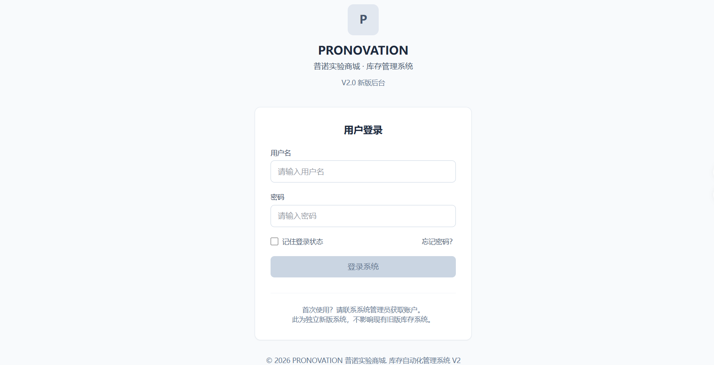
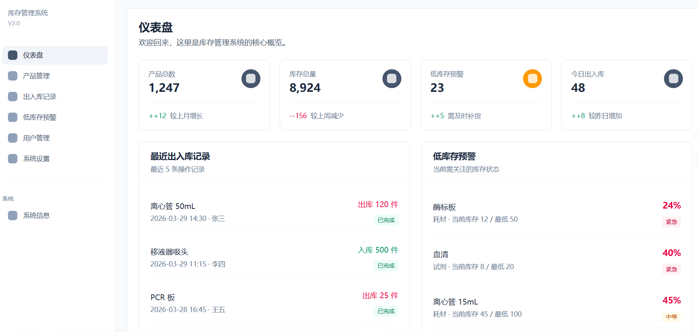
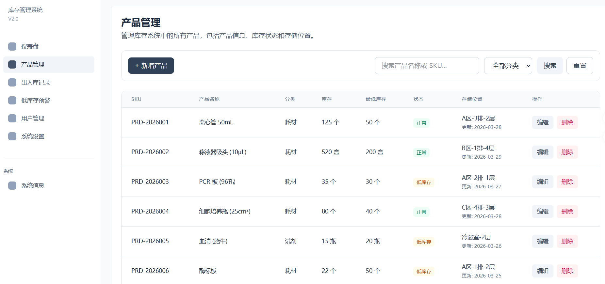
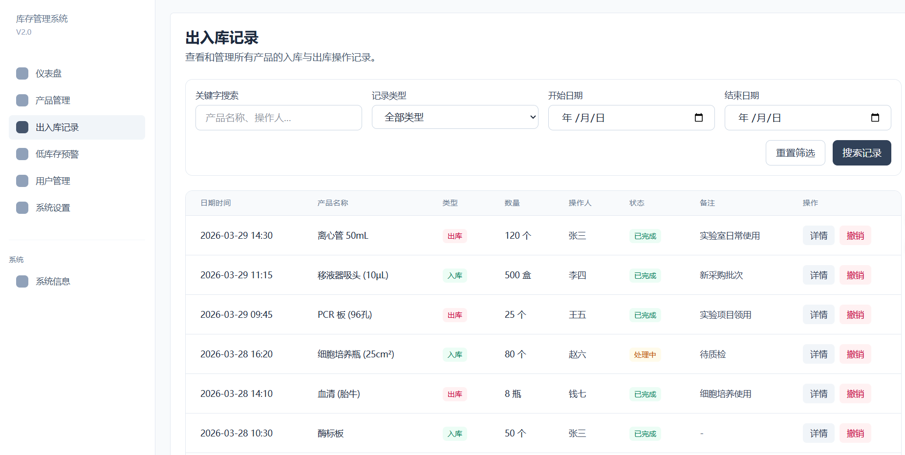
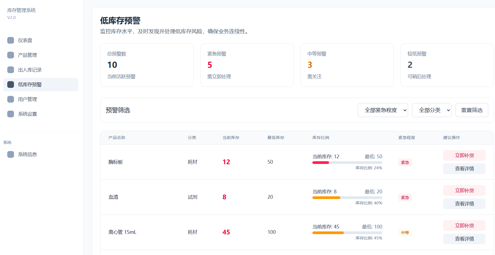
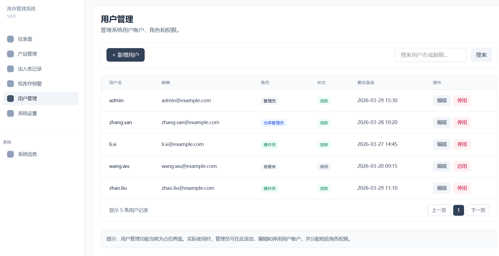
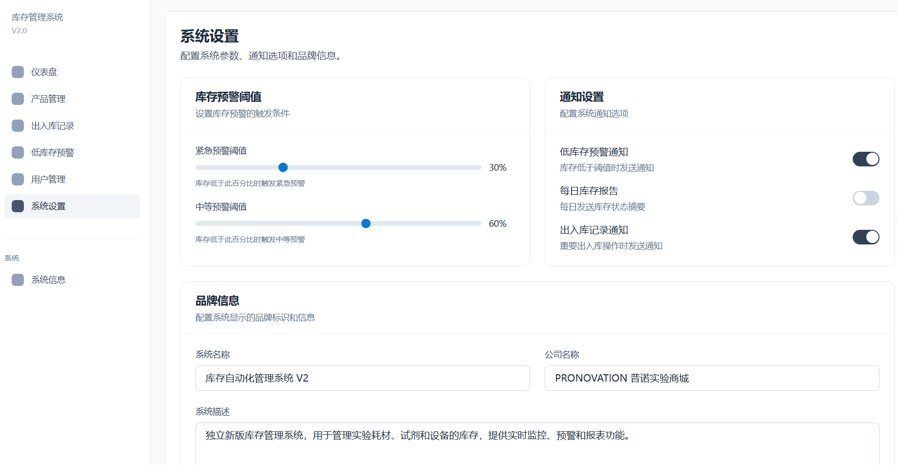

````md
# 库存自动化管理系统 V2

一个面向实验室耗材与库存场景的现代化库存管理系统前端重设计版。

## 项目定位

本项目是基于旧版库存自动化管理系统重新启动的 V2 版本。

目标不是修改当前正在使用的旧系统，而是独立重做一个新版前端项目，用于：

- 重设计系统 UI
- 优化后台布局与界面层级
- 提升专业感和品牌感
- 为后续接入真实业务逻辑打下更清晰的前端基础

## 当前状态

当前项目已完成第一阶段，主要成果包括：

- 完成新版后台主要页面与导航结构
- 建立统一的视觉系统与蓝灰中性色调风格
- 使用 mock 数据完成前端原型展示
- 不接入真实数据库和真实后端逻辑
- 可作为独立前端原型继续演示和扩展

## 第一阶段已完成页面

- 登录页
- 仪表盘首页
- 产品管理页
- 出入库记录页
- 低库存预警页
- 用户管理页
- 系统设置页

## 第一阶段已完成内容

- React + Vite + Tailwind CSS 项目初始化
- 全局视觉系统与品牌色基础
- 后台主布局（侧边栏、顶部栏、内容区）
- 路由配置与菜单联动
- 核心业务页面 UI
- 用户管理与系统设置基础占位页
- docs 项目过程记录
- CLAUDE.md 项目规则文档

## 第一阶段暂不包含

- 真实数据库接入
- 真实登录鉴权
- 用户权限逻辑
- Excel 导入导出
- 报表统计
- 自动备份恢复
- 多仓库支持

## 技术栈

- React
- Vite
- Tailwind CSS

## 项目特点

- 独立于旧库存系统，不影响现有系统使用
- 风格简洁、专业、克制，偏企业后台
- 使用 mock 数据，便于前端结构和 UI 演示
- 避免营销官网风格和明显 AI 拼装感
- 适合作为后续第二阶段真实业务开发的前端基础

## 本地启动

```bash
npm install
npm run dev
````

默认开发地址：

`http://localhost:5173`

## 页面预览

### 登录页



### 仪表盘



### 产品管理



### 出入库记录



### 低库存预警



### 用户管理



### 系统设置



## docs 目录说明

项目过程文档保存在 `docs/` 目录中，包括：

* `01-项目说明.txt`
* `02-项目初始化记录.txt`
* `03-第一阶段开发计划.txt`
* `04-开发阶段记录.txt`
* `06-第一阶段完成检查.txt`
* `07-第一阶段总结.txt`

## 下一步方向

后续可按两条路线继续推进：

### 方案 A：进入第二阶段

* 接入真实后端 API
* 接入真实登录鉴权
* 接入数据库
* 实现真实产品、记录、预警等业务逻辑

### 方案 B：继续优化前端

* 替换图标占位
* 优化响应式细节
* 继续打磨表格、分页、表单和空状态
* 优化演示与展示效果

## 说明

本项目当前版本为第一阶段完成版，主要用于新版库存自动化管理系统的前端原型展示与后续开发基础搭建。